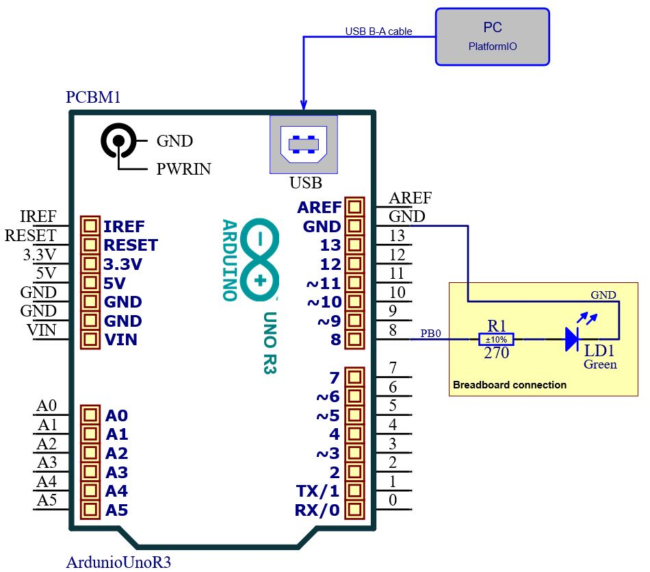

# Lab 1: Dominik Caban 

### Morse code

1. Listing of C code which repeats one "dot" and one "comma" (BTW, in Morse code it is letter `A`) on a LED. Always use syntax highlighting, meaningful comments, and follow C guidelines:

```c
/* Defines -----------------------------------------------------------*/
#define LED_GREEN PB0   // PB0 is AVR pin where green on-board LED
                        // is connected
#define SHORT_DELAY 250 // Delay in milliseconds
#define LONG_DELAY 750  // Delay in milliseconds EDITED
#define END_DELAY 750   // Delay in milliseconds EDITED
#ifndef F_CPU
#define F_CPU 16000000 // CPU frequency in Hz required for delay funcs
#endif

/* Includes ----------------------------------------------------------*/
#include <avr/io.h>     // AVR device-specific IO definitions
#include <util/delay.h> // Functions for busy-wait delay loops

// -----
// This part is needed to use Arduino functions but also physical pin
// names. We are using Arduino-style just to simplify the first lab.
#include "Arduino.h"
#define PB5 13 // In Arduino world, PB5 is called "13"
#define PB0 8  // In Arduino world, PB0 is called "8"
// -----

/* Function definitions ----------------------------------------------*/
/**********************************************************************
 * Function: Main function where the program execution begins
 * Purpose:  Toggle one LED and use delay library.
 * Returns:  none
 **********************************************************************/
int main(void)
{
    uint8_t led_value = LOW; // Local variable to keep LED status

    // Set pin where on-board LED is connected as output
    pinMode(LED_GREEN, OUTPUT);

    // Infinite loop
    while (1)
    {
        digitalWrite(LED_GREEN, HIGH);
        _delay_ms(SHORT_DELAY);
        digitalWrite(LED_GREEN, LOW);
        _delay_ms(SHORT_DELAY);
        digitalWrite(LED_GREEN, HIGH);
        _delay_ms(LONG_DELAY);
        digitalWrite(LED_GREEN, LOW);
        _delay_ms(END_DELAY);
    }

    // Will never reach this
    return 0;
}
```

2. Scheme of Morse code application, i.e. connection of AVR device, LED, resistor, and supply voltage. The image can be drawn on a computer or by hand. Always name all components and their values!

   