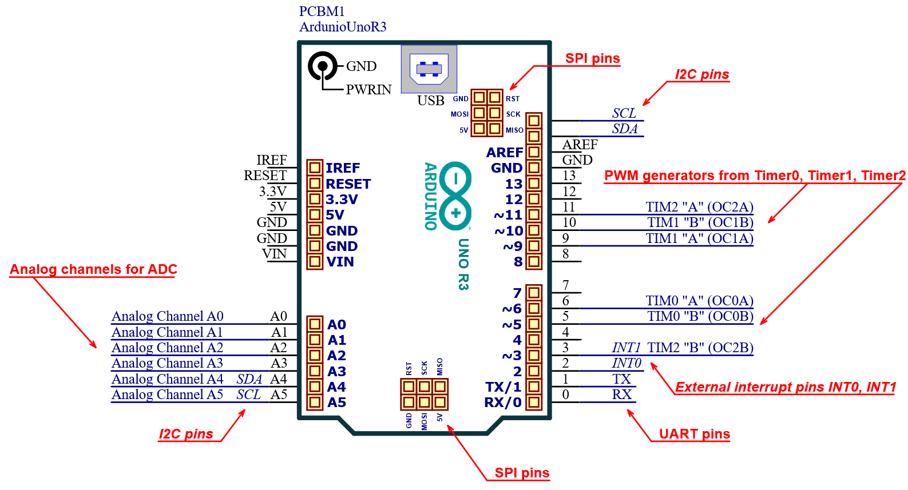
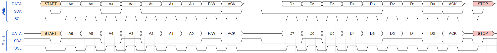

# Lab 7: Dominik Caban

### Arduino Uno pinout

1. In the picture of the Arduino Uno board, mark the pins that can be used for the following functions/operations:
   * PWM generators from Timer0, Timer1, Timer2
   * analog channels for ADC
   * UART pins
   * I2C pins
   * SPI pins
   * external interrupt pins INT0, INT1

   

### I2C communication

2. Draw a timing diagram of I2C signals when calling function `rtc_read_years()`. Let this function reads one byte-value from RTC DS3231 address `06h` (see RTC datasheet) in the range `00` to `99`. Specify when the SDA line is controlled by the Master device and when by the Slave device. Draw the whole request/receive process, from Start to Stop condition. The image can be drawn on a computer (by [WaveDrom](https://wavedrom.com/) for example) or by hand. Name all parts of timing diagram.

   

```javascript
{signal: [
  [ 'Write', 
    {name: 'DATA', wave: 'zz4.2.2.2.2.2.2.2.2.2.zzzz2.2.2.2.2.2.2.2.2.z9.z', data: 'START A6 A5 A4 A3 A2 A1 A0 R/W ACK D7 D6 D5 D4 D3 D2 D1 D0 ACK STOP', phase: 0.5},
    {name: 'SDA', wave:  '1..01...0.1.0.......0.1.0...........1...0.0.101.', phase: 0.5},
    {name: 'SCL', wave:  '1.0.101010101010101010....101010101010101010.1.'},
  ],
  {},
  [ 'Read', 
    {name: 'DATA', wave: 'zz4.2.2.2.2.2.2.2.2.2.zzzz2.2.2.2.2.2.2.2.2.z9.z', data: 'START A6 A5 A4 A3 A2 A1 A0 R/W ACK D7 D6 D5 D4 D3 D2 D1 D0 ACK STOP', phase: 0.5},
    {name: 'SDA', wave:  '1..01...0.1.0.....1.0.1.0...1.0.....1...0.0.101.', phase: 0.5},
    {name: 'SCL', wave:  '1.0.101010101010101010....101010101010101010.1.'},
  ],
]}
  ```
### Meteo station

Consider an application for temperature and humidity measurements. Use sensor DHT12, real time clock DS3231, LCD, and one LED. Every minute, the temperature, humidity, and time is requested from Slave devices and values are displayed on LCD screen. When the temperature is above the threshold, turn on the LED.

3. Draw a flowchart of `TIMER1_OVF_vect` (which overflows every 1&nbsp;sec) for such Meteo station. The image can be drawn on a computer or by hand. Use clear description of individual algorithm steps.

   